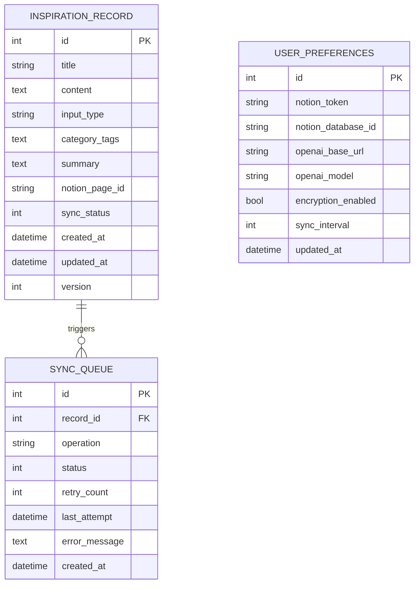
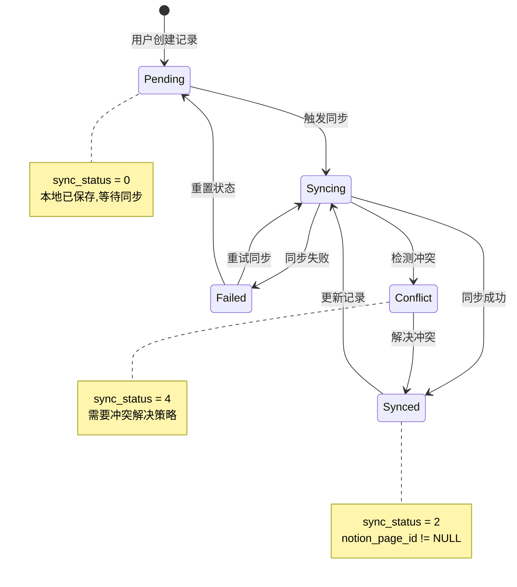
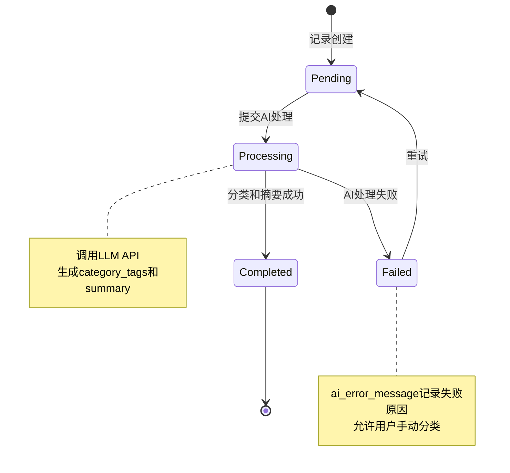

# Data Model: 多模输入灵感记录器

**Feature**: 1-multimodal-capture
**Date**: 2025-10-27
**Status**: Design Phase

## Overview

本文档定义了多模输入灵感记录器的完整数据模型,包括实体定义、字段规范、关系映射、验证规则和状态转换逻辑。数据模型同时适用于Flutter前端(Drift ORM)和FastAPI后端(SQLAlchemy)。

---

## Entity Relationship Diagram



---

## 1. InspirationRecord (灵感记录)

### 1.1 Entity Definition

**用途**: 存储用户通过语音、文字或图片输入的灵感内容及其处理结果。

**表名**: `inspiration_records`

### 1.2 Fields

| 字段名 | 类型 | 约束 | 默认值 | 说明 |
|--------|------|------|--------|------|
| `id` | INTEGER | PRIMARY KEY, AUTO_INCREMENT | - | 唯一标识符 |
| `title` | VARCHAR(200) | NOT NULL | - | 灵感标题(自动从内容提取或用户输入) |
| `content` | TEXT | NOT NULL | - | 原始内容(语音转写文本/用户输入/OCR识别文本) |
| `input_type` | VARCHAR(20) | NOT NULL | - | 输入方式: `voice`/`text`/`image` |
| `category_tags` | TEXT | NULL | NULL | AI生成的分类标签(JSON数组字符串) |
| `summary` | TEXT | NULL | NULL | AI生成的摘要(不超过50字) |
| `notion_page_id` | VARCHAR(100) | NULL, UNIQUE | NULL | Notion页面ID(同步后赋值) |
| `sync_status` | INTEGER | NOT NULL | 0 | 同步状态: 0=pending, 1=syncing, 2=synced, 3=failed, 4=conflict |
| `created_at` | DATETIME | NOT NULL | CURRENT_TIMESTAMP | 创建时间 |
| `updated_at` | DATETIME | NOT NULL | CURRENT_TIMESTAMP | 最后更新时间(用于冲突解决) |
| `version` | INTEGER | NOT NULL | 1 | 乐观锁版本号(每次更新+1) |
| `audio_file_path` | VARCHAR(500) | NULL | NULL | 语音文件本地路径(仅input_type=voice) |
| `image_file_path` | VARCHAR(500) | NULL | NULL | 图片文件本地路径(仅input_type=image) |
| `ocr_confidence` | REAL | NULL | NULL | OCR识别置信度(0.0-1.0) |
| `ai_processing_status` | INTEGER | NOT NULL | 0 | AI处理状态: 0=pending, 1=processing, 2=completed, 3=failed |
| `ai_error_message` | TEXT | NULL | NULL | AI处理失败原因 |

### 1.3 Validation Rules

```python
# Backend (Pydantic)
from pydantic import BaseModel, Field, validator
from datetime import datetime
from typing import List, Optional
from enum import Enum

class InputType(str, Enum):
    VOICE = "voice"
    TEXT = "text"
    IMAGE = "image"

class SyncStatus(int, Enum):
    PENDING = 0
    SYNCING = 1
    SYNCED = 2
    FAILED = 3
    CONFLICT = 4

class AIProcessingStatus(int, Enum):
    PENDING = 0
    PROCESSING = 1
    COMPLETED = 2
    FAILED = 3

class InspirationRecordCreate(BaseModel):
    title: str = Field(..., min_length=1, max_length=200, description="灵感标题")
    content: str = Field(..., min_length=1, max_length=10000, description="原始内容")
    input_type: InputType
    audio_file_path: Optional[str] = None
    image_file_path: Optional[str] = None
    ocr_confidence: Optional[float] = Field(None, ge=0.0, le=1.0)

    @validator('content')
    def validate_content_length(cls, v, values):
        if len(v.strip()) < 10:
            raise ValueError('内容至少需要10个字符')
        return v.strip()

    @validator('audio_file_path')
    def validate_audio_path(cls, v, values):
        if values.get('input_type') == InputType.VOICE and not v:
            raise ValueError('语音输入必须提供音频文件路径')
        return v

    @validator('image_file_path')
    def validate_image_path(cls, v, values):
        if values.get('input_type') == InputType.IMAGE and not v:
            raise ValueError('图片输入必须提供图片文件路径')
        return v

class InspirationRecordUpdate(BaseModel):
    title: Optional[str] = Field(None, min_length=1, max_length=200)
    content: Optional[str] = Field(None, min_length=10, max_length=10000)
    category_tags: Optional[List[str]] = None
    summary: Optional[str] = Field(None, max_length=200)

class InspirationRecordResponse(BaseModel):
    id: int
    title: str
    content: str
    input_type: InputType
    category_tags: Optional[List[str]] = None
    summary: Optional[str] = None
    notion_page_id: Optional[str] = None
    sync_status: SyncStatus
    created_at: datetime
    updated_at: datetime
    version: int
    audio_file_path: Optional[str] = None
    image_file_path: Optional[str] = None
    ocr_confidence: Optional[float] = None
    ai_processing_status: AIProcessingStatus
    ai_error_message: Optional[str] = None

    class Config:
        from_attributes = True
```

```dart
// Frontend (Drift)
import 'package:drift/drift.dart';

class InspirationRecords extends Table {
  IntColumn get id => integer().autoIncrement()();
  TextColumn get title => text().withLength(min: 1, max: 200)();
  TextColumn get content => text()();
  TextColumn get inputType => text().withLength(min: 1, max: 20)();
  TextColumn get categoryTags => text().nullable()();
  TextColumn get summary => text().nullable()();
  TextColumn get notionPageId => text().withLength(max: 100).nullable().unique()();
  IntColumn get syncStatus => integer().withDefault(const Constant(0))();
  DateTimeColumn get createdAt => dateTime().withDefault(currentDateAndTime)();
  DateTimeColumn get updatedAt => dateTime().withDefault(currentDateAndTime)();
  IntColumn get version => integer().withDefault(const Constant(1))();
  TextColumn get audioFilePath => text().nullable()();
  TextColumn get imageFilePath => text().nullable()();
  RealColumn get ocrConfidence => real().nullable()();
  IntColumn get aiProcessingStatus => integer().withDefault(const Constant(0))();
  TextColumn get aiErrorMessage => text().nullable()();
}

// Domain Model
class InspirationRecord {
  final int id;
  final String title;
  final String content;
  final InputType inputType;
  final List<String>? categoryTags;
  final String? summary;
  final String? notionPageId;
  final SyncStatus syncStatus;
  final DateTime createdAt;
  final DateTime updatedAt;
  final int version;
  final String? audioFilePath;
  final String? imageFilePath;
  final double? ocrConfidence;
  final AIProcessingStatus aiProcessingStatus;
  final String? aiErrorMessage;

  InspirationRecord({
    required this.id,
    required this.title,
    required this.content,
    required this.inputType,
    this.categoryTags,
    this.summary,
    this.notionPageId,
    required this.syncStatus,
    required this.createdAt,
    required this.updatedAt,
    required this.version,
    this.audioFilePath,
    this.imageFilePath,
    this.ocrConfidence,
    required this.aiProcessingStatus,
    this.aiErrorMessage,
  });

  // Validation
  String? validate() {
    if (title.trim().isEmpty) return '标题不能为空';
    if (content.trim().length < 10) return '内容至少需要10个字符';
    if (inputType == InputType.voice && audioFilePath == null) {
      return '语音输入必须提供音频文件';
    }
    if (inputType == InputType.image && imageFilePath == null) {
      return '图片输入必须提供图片文件';
    }
    return null;
  }
}

enum InputType {
  voice('voice', '语音'),
  text('text', '文字'),
  image('image', '图片');

  final String value;
  final String label;
  const InputType(this.value, this.label);
}

enum SyncStatus {
  pending(0, '待同步'),
  syncing(1, '同步中'),
  synced(2, '已同步'),
  failed(3, '失败'),
  conflict(4, '冲突');

  final int value;
  final String label;
  const SyncStatus(this.value, this.label);
}

enum AIProcessingStatus {
  pending(0, '待处理'),
  processing(1, '处理中'),
  completed(2, '已完成'),
  failed(3, '失败');

  final int value;
  final String label;
  const AIProcessingStatus(this.value, this.label);
}
```

### 1.4 Indexes

```sql
-- 创建索引以优化查询性能
CREATE INDEX idx_inspiration_created_at ON inspiration_records(created_at DESC);
CREATE INDEX idx_inspiration_sync_status ON inspiration_records(sync_status);
CREATE INDEX idx_inspiration_input_type ON inspiration_records(input_type);
CREATE INDEX idx_inspiration_updated_at ON inspiration_records(updated_at DESC);
CREATE INDEX idx_inspiration_ai_status ON inspiration_records(ai_processing_status);

-- 复合索引用于同步队列查询
CREATE INDEX idx_sync_pending ON inspiration_records(sync_status, updated_at)
  WHERE sync_status IN (0, 3);  -- PENDING or FAILED
```

### 1.5 State Transitions



**AI处理状态转换**:



---

## 2. SyncQueue (同步队列)

### 2.1 Entity Definition

**用途**: 持久化同步任务队列,支持失败重试和优先级管理。

**表名**: `sync_queue`

### 2.2 Fields

| 字段名 | 类型 | 约束 | 默认值 | 说明 |
|--------|------|------|--------|------|
| `id` | INTEGER | PRIMARY KEY, AUTO_INCREMENT | - | 任务ID |
| `record_id` | INTEGER | NOT NULL, FK | - | 关联的inspiration_record.id |
| `operation` | VARCHAR(20) | NOT NULL | - | 操作类型: `create`/`update`/`delete` |
| `status` | INTEGER | NOT NULL | 0 | 任务状态: 0=pending, 1=processing, 2=completed, 3=failed |
| `retry_count` | INTEGER | NOT NULL | 0 | 重试次数 |
| `max_retries` | INTEGER | NOT NULL | 5 | 最大重试次数 |
| `last_attempt_at` | DATETIME | NULL | NULL | 最后一次尝试时间 |
| `next_retry_at` | DATETIME | NULL | NULL | 下次重试时间(指数退避) |
| `error_message` | TEXT | NULL | NULL | 最后一次失败的错误信息 |
| `priority` | INTEGER | NOT NULL | 0 | 优先级: 0=normal, 1=high, 2=urgent |
| `created_at` | DATETIME | NOT NULL | CURRENT_TIMESTAMP | 任务创建时间 |
| `completed_at` | DATETIME | NULL | NULL | 任务完成时间 |

### 2.3 Validation Rules

```python
from enum import Enum
from pydantic import BaseModel, Field
from datetime import datetime
from typing import Optional

class SyncOperation(str, Enum):
    CREATE = "create"
    UPDATE = "update"
    DELETE = "delete"

class SyncQueueStatus(int, Enum):
    PENDING = 0
    PROCESSING = 1
    COMPLETED = 2
    FAILED = 3

class SyncPriority(int, Enum):
    NORMAL = 0
    HIGH = 1
    URGENT = 2

class SyncTaskCreate(BaseModel):
    record_id: int = Field(..., gt=0)
    operation: SyncOperation
    priority: SyncPriority = SyncPriority.NORMAL

class SyncTaskResponse(BaseModel):
    id: int
    record_id: int
    operation: SyncOperation
    status: SyncQueueStatus
    retry_count: int
    max_retries: int
    last_attempt_at: Optional[datetime] = None
    next_retry_at: Optional[datetime] = None
    error_message: Optional[str] = None
    priority: SyncPriority
    created_at: datetime
    completed_at: Optional[datetime] = None

    class Config:
        from_attributes = True
```

```dart
// Frontend (Drift)
class SyncQueue extends Table {
  IntColumn get id => integer().autoIncrement()();
  IntColumn get recordId => integer().references(InspirationRecords, #id)();
  TextColumn get operation => text().withLength(max: 20)();
  IntColumn get status => integer().withDefault(const Constant(0))();
  IntColumn get retryCount => integer().withDefault(const Constant(0))();
  IntColumn get maxRetries => integer().withDefault(const Constant(5))();
  DateTimeColumn get lastAttemptAt => dateTime().nullable()();
  DateTimeColumn get nextRetryAt => dateTime().nullable()();
  TextColumn get errorMessage => text().nullable()();
  IntColumn get priority => integer().withDefault(const Constant(0))();
  DateTimeColumn get createdAt => dateTime().withDefault(currentDateAndTime)();
  DateTimeColumn get completedAt => dateTime().nullable()();
}
```

### 2.4 Indexes

```sql
CREATE INDEX idx_sync_queue_status ON sync_queue(status, priority DESC, created_at);
CREATE INDEX idx_sync_queue_record ON sync_queue(record_id);
CREATE INDEX idx_sync_queue_retry ON sync_queue(next_retry_at) WHERE status = 3;
```

### 2.5 Business Rules

1. **重试策略**: 指数退避算法
   ```python
   next_retry_delay = min(4 * (2 ** retry_count), 60)  # 4s, 8s, 16s, 32s, 60s
   next_retry_at = last_attempt_at + timedelta(seconds=next_retry_delay)
   ```

2. **优先级规则**:
   - `URGENT`: 用户手动触发的同步
   - `HIGH`: 新创建的记录
   - `NORMAL`: 定时批量同步

3. **失败处理**:
   - 达到`max_retries`后,标记为`FAILED`
   - 用户可在UI中查看失败原因并手动重试

---

## 3. UserPreferences (用户配置)

### 3.1 Entity Definition

**用途**: 存储用户个性化配置和集成凭证。

**表名**: `user_preferences`

### 3.2 Fields

| 字段名 | 类型 | 约束 | 默认值 | 说明 |
|--------|------|------|--------|------|
| `id` | INTEGER | PRIMARY KEY | 1 | 固定为1(单用户模式) |
| `notion_token` | VARCHAR(500) | NULL | NULL | Notion Integration Token(加密存储) |
| `notion_database_id` | VARCHAR(100) | NULL | NULL | Notion数据库ID |
| `openai_base_url` | VARCHAR(500) | NOT NULL | 'http://localhost:11434/v1' | LLM API Base URL |
| `openai_api_key` | VARCHAR(500) | NULL | NULL | LLM API Key(加密存储) |
| `openai_model` | VARCHAR(100) | NOT NULL | 'llama3.1' | LLM模型名称 |
| `encryption_enabled` | BOOLEAN | NOT NULL | false | 是否启用数据库加密 |
| `sync_interval` | INTEGER | NOT NULL | 1800 | 自动同步间隔(秒),0=禁用 |
| `sync_on_network` | BOOLEAN | NOT NULL | true | 网络恢复时自动同步 |
| `ui_language` | VARCHAR(10) | NOT NULL | 'zh_CN' | 界面语言: zh_CN/en_US |
| `theme_mode` | VARCHAR(10) | NOT NULL | 'system' | 主题模式: system/light/dark |
| `max_voice_duration` | INTEGER | NOT NULL | 300 | 最大录音时长(秒) |
| `auto_classify` | BOOLEAN | NOT NULL | true | 是否自动分类 |
| `auto_summarize` | BOOLEAN | NOT NULL | true | 是否自动摘要 |
| `updated_at` | DATETIME | NOT NULL | CURRENT_TIMESTAMP | 最后更新时间 |

### 3.3 Validation Rules

```python
from pydantic import BaseModel, Field, HttpUrl, validator
from typing import Optional

class UserPreferencesUpdate(BaseModel):
    notion_token: Optional[str] = Field(None, min_length=50, max_length=500)
    notion_database_id: Optional[str] = Field(None, min_length=32, max_length=100)
    openai_base_url: HttpUrl
    openai_api_key: Optional[str] = Field(None, max_length=500)
    openai_model: str = Field(..., min_length=1, max_length=100)
    encryption_enabled: bool = False
    sync_interval: int = Field(1800, ge=0, le=86400)  # 0-24小时
    sync_on_network: bool = True
    ui_language: str = Field('zh_CN', regex=r'^(zh_CN|en_US)$')
    theme_mode: str = Field('system', regex=r'^(system|light|dark)$')
    max_voice_duration: int = Field(300, ge=60, le=600)  # 1-10分钟
    auto_classify: bool = True
    auto_summarize: bool = True

    @validator('sync_interval')
    def validate_sync_interval(cls, v):
        if v > 0 and v < 300:
            raise ValueError('同步间隔不能小于5分钟(300秒)')
        return v

class UserPreferencesResponse(UserPreferencesUpdate):
    id: int
    updated_at: datetime

    class Config:
        from_attributes = True
```

### 3.4 Security Considerations

1. **敏感字段加密**:
   - `notion_token`
   - `openai_api_key`

2. **加密方式**:
   - Flutter: `flutter_secure_storage`
   - Backend: Fernet对称加密 + 环境变量密钥

```python
from cryptography.fernet import Fernet
import os

class SecurePreferences:
    def __init__(self):
        self.cipher = Fernet(os.getenv('ENCRYPTION_KEY').encode())

    def encrypt(self, plaintext: str) -> str:
        return self.cipher.encrypt(plaintext.encode()).decode()

    def decrypt(self, ciphertext: str) -> str:
        return self.cipher.decrypt(ciphertext.encode()).decode()
```

---

## 4. Category (分类标签)

### 4.1 Predefined Categories

虽然分类标签由AI生成,但系统预定义了常见类别以提高一致性:

```python
PREDEFINED_CATEGORIES = [
    "产品创意",
    "技术灵感",
    "商业想法",
    "写作素材",
    "学习笔记",
    "生活感悟",
    "待办事项",
    "项目规划",
    "设计灵感",
    "其他"
]
```

### 4.2 Storage Format

分类标签存储为JSON数组字符串:

```json
["产品创意", "技术灵感"]
```

**Frontend解析**:
```dart
List<String> parseCategoryTags(String? jsonString) {
  if (jsonString == null || jsonString.isEmpty) return [];
  return (jsonDecode(jsonString) as List).cast<String>();
}

String serializeCategoryTags(List<String> tags) {
  return jsonEncode(tags);
}
```

---

## 5. Data Volume Constraints

### 5.1 Storage Limits

根据需求FR-123,每个用户最多存储1,000条灵感记录。

**实施策略**:

```python
async def check_storage_limit(user_id: int = 1) -> bool:
    """检查是否达到存储上限"""
    count = await db.query(InspirationRecord).filter_by(user_id=user_id).count()
    return count < 1000

async def cleanup_old_records(user_id: int = 1, keep_count: int = 900):
    """清理旧记录,保留最新的keep_count条"""
    old_records = await db.query(InspirationRecord) \
        .filter_by(user_id=user_id) \
        .order_by(InspirationRecord.created_at.desc()) \
        .offset(keep_count) \
        .all()

    for record in old_records:
        await db.delete(record)
    await db.commit()
```

### 5.2 File Storage Estimates

基于research.md中的测试数据:

| 项目 | 单条大小 | 1000条总计 |
|------|---------|-----------|
| 纯文本数据 | ~670 bytes | ~670 KB |
| 语音文件(5分钟AAC) | 3.6 MB | 3.6 GB |
| 图片文件(平均) | 500 KB | 500 MB |
| 缩略图(200x200) | 20 KB | 20 MB |
| 数据库(含加密) | ~1 KB/条 | ~1.1 MB |

**总计(混合场景)**:
- 纯文本: ~1 MB
- 含媒体文件: ~1.3 GB (假设30%语音 + 30%图片 + 40%文本)

---

## 6. Migration Strategy

### 6.1 Schema Versioning

采用Drift和Alembic的版本管理:

```dart
// Flutter - Drift Migration
@override
int get schemaVersion => 2;

@override
MigrationStrategy get migration => MigrationStrategy(
  onCreate: (Migrator m) async {
    await m.createAll();
  },
  onUpgrade: (Migrator m, int from, int to) async {
    if (from == 1) {
      // Version 1 -> 2: 添加AI处理状态字段
      await m.addColumn(inspirationRecords, inspirationRecords.aiProcessingStatus);
      await m.addColumn(inspirationRecords, inspirationRecords.aiErrorMessage);
    }
  },
);
```

```python
# Backend - Alembic Migration
"""add ai processing status

Revision ID: 002
Revises: 001
Create Date: 2025-10-27
"""
from alembic import op
import sqlalchemy as sa

def upgrade():
    op.add_column('inspiration_records',
        sa.Column('ai_processing_status', sa.Integer(), nullable=False, server_default='0'))
    op.add_column('inspiration_records',
        sa.Column('ai_error_message', sa.Text(), nullable=True))

def downgrade():
    op.drop_column('inspiration_records', 'ai_error_message')
    op.drop_column('inspiration_records', 'ai_processing_status')
```

---

## 7. Data Integrity Rules

### 7.1 Foreign Key Constraints

```sql
-- SyncQueue references InspirationRecord
ALTER TABLE sync_queue
  ADD CONSTRAINT fk_sync_queue_record
  FOREIGN KEY (record_id)
  REFERENCES inspiration_records(id)
  ON DELETE CASCADE;
```

### 7.2 Check Constraints

```sql
-- InspirationRecord
ALTER TABLE inspiration_records
  ADD CONSTRAINT chk_input_type
  CHECK (input_type IN ('voice', 'text', 'image'));

ALTER TABLE inspiration_records
  ADD CONSTRAINT chk_sync_status
  CHECK (sync_status BETWEEN 0 AND 4);

ALTER TABLE inspiration_records
  ADD CONSTRAINT chk_version_positive
  CHECK (version > 0);

-- SyncQueue
ALTER TABLE sync_queue
  ADD CONSTRAINT chk_retry_count
  CHECK (retry_count >= 0 AND retry_count <= max_retries);

ALTER TABLE sync_queue
  ADD CONSTRAINT chk_priority
  CHECK (priority BETWEEN 0 AND 2);

-- UserPreferences
ALTER TABLE user_preferences
  ADD CONSTRAINT chk_single_user
  CHECK (id = 1);

ALTER TABLE user_preferences
  ADD CONSTRAINT chk_sync_interval
  CHECK (sync_interval = 0 OR sync_interval >= 300);
```

---

## 8. Example Data

### 8.1 Sample InspirationRecord

```json
{
  "id": 1,
  "title": "AI产品创意:智能会议助手",
  "content": "今天开会时想到可以做一个AI会议助手,自动记录会议内容、生成摘要和待办事项,并能根据上下文智能提醒。核心功能包括语音实时转写、关键信息提取、智能日程集成。",
  "input_type": "voice",
  "category_tags": ["产品创意", "技术灵感", "待办事项"],
  "summary": "AI会议助手产品构想:实时转写+智能摘要+待办提醒",
  "notion_page_id": "a1b2c3d4-e5f6-7890-abcd-ef1234567890",
  "sync_status": 2,
  "created_at": "2025-10-27T10:30:00Z",
  "updated_at": "2025-10-27T10:31:15Z",
  "version": 1,
  "audio_file_path": "/storage/audio/20251027_103000.m4a",
  "image_file_path": null,
  "ocr_confidence": null,
  "ai_processing_status": 2,
  "ai_error_message": null
}
```

### 8.2 Sample SyncQueue

```json
{
  "id": 1,
  "record_id": 1,
  "operation": "create",
  "status": 2,
  "retry_count": 0,
  "max_retries": 5,
  "last_attempt_at": "2025-10-27T10:31:00Z",
  "next_retry_at": null,
  "error_message": null,
  "priority": 1,
  "created_at": "2025-10-27T10:30:05Z",
  "completed_at": "2025-10-27T10:31:15Z"
}
```

### 8.3 Sample UserPreferences

```json
{
  "id": 1,
  "notion_token": "secret_abc123...",
  "notion_database_id": "a1b2c3d4e5f67890",
  "openai_base_url": "http://localhost:11434/v1",
  "openai_api_key": null,
  "openai_model": "llama3.1",
  "encryption_enabled": true,
  "sync_interval": 1800,
  "sync_on_network": true,
  "ui_language": "zh_CN",
  "theme_mode": "system",
  "max_voice_duration": 300,
  "auto_classify": true,
  "auto_summarize": true,
  "updated_at": "2025-10-27T09:00:00Z"
}
```

---

## 9. Database Initialization Scripts

### 9.1 SQLite Schema (Backend)

```sql
-- File: backend/src/database/schema.sql

-- Enable Foreign Keys
PRAGMA foreign_keys = ON;

-- Enable WAL Mode
PRAGMA journal_mode = WAL;

-- Performance Settings
PRAGMA synchronous = NORMAL;
PRAGMA temp_store = MEMORY;
PRAGMA mmap_size = 30000000000;
PRAGMA page_size = 4096;

-- Create Tables
CREATE TABLE IF NOT EXISTS inspiration_records (
    id INTEGER PRIMARY KEY AUTOINCREMENT,
    title VARCHAR(200) NOT NULL,
    content TEXT NOT NULL,
    input_type VARCHAR(20) NOT NULL,
    category_tags TEXT,
    summary TEXT,
    notion_page_id VARCHAR(100) UNIQUE,
    sync_status INTEGER NOT NULL DEFAULT 0,
    created_at DATETIME NOT NULL DEFAULT CURRENT_TIMESTAMP,
    updated_at DATETIME NOT NULL DEFAULT CURRENT_TIMESTAMP,
    version INTEGER NOT NULL DEFAULT 1,
    audio_file_path VARCHAR(500),
    image_file_path VARCHAR(500),
    ocr_confidence REAL,
    ai_processing_status INTEGER NOT NULL DEFAULT 0,
    ai_error_message TEXT,
    CHECK (input_type IN ('voice', 'text', 'image')),
    CHECK (sync_status BETWEEN 0 AND 4),
    CHECK (version > 0)
);

CREATE TABLE IF NOT EXISTS sync_queue (
    id INTEGER PRIMARY KEY AUTOINCREMENT,
    record_id INTEGER NOT NULL,
    operation VARCHAR(20) NOT NULL,
    status INTEGER NOT NULL DEFAULT 0,
    retry_count INTEGER NOT NULL DEFAULT 0,
    max_retries INTEGER NOT NULL DEFAULT 5,
    last_attempt_at DATETIME,
    next_retry_at DATETIME,
    error_message TEXT,
    priority INTEGER NOT NULL DEFAULT 0,
    created_at DATETIME NOT NULL DEFAULT CURRENT_TIMESTAMP,
    completed_at DATETIME,
    FOREIGN KEY (record_id) REFERENCES inspiration_records(id) ON DELETE CASCADE,
    CHECK (retry_count >= 0 AND retry_count <= max_retries),
    CHECK (priority BETWEEN 0 AND 2)
);

CREATE TABLE IF NOT EXISTS user_preferences (
    id INTEGER PRIMARY KEY CHECK (id = 1),
    notion_token VARCHAR(500),
    notion_database_id VARCHAR(100),
    openai_base_url VARCHAR(500) NOT NULL DEFAULT 'http://localhost:11434/v1',
    openai_api_key VARCHAR(500),
    openai_model VARCHAR(100) NOT NULL DEFAULT 'llama3.1',
    encryption_enabled BOOLEAN NOT NULL DEFAULT 0,
    sync_interval INTEGER NOT NULL DEFAULT 1800,
    sync_on_network BOOLEAN NOT NULL DEFAULT 1,
    ui_language VARCHAR(10) NOT NULL DEFAULT 'zh_CN',
    theme_mode VARCHAR(10) NOT NULL DEFAULT 'system',
    max_voice_duration INTEGER NOT NULL DEFAULT 300,
    auto_classify BOOLEAN NOT NULL DEFAULT 1,
    auto_summarize BOOLEAN NOT NULL DEFAULT 1,
    updated_at DATETIME NOT NULL DEFAULT CURRENT_TIMESTAMP,
    CHECK (sync_interval = 0 OR sync_interval >= 300)
);

-- Create Indexes
CREATE INDEX idx_inspiration_created_at ON inspiration_records(created_at DESC);
CREATE INDEX idx_inspiration_sync_status ON inspiration_records(sync_status);
CREATE INDEX idx_inspiration_input_type ON inspiration_records(input_type);
CREATE INDEX idx_inspiration_updated_at ON inspiration_records(updated_at DESC);
CREATE INDEX idx_inspiration_ai_status ON inspiration_records(ai_processing_status);

CREATE INDEX idx_sync_queue_status ON sync_queue(status, priority DESC, created_at);
CREATE INDEX idx_sync_queue_record ON sync_queue(record_id);
CREATE INDEX idx_sync_queue_retry ON sync_queue(next_retry_at) WHERE status = 3;

-- Insert Default UserPreferences
INSERT INTO user_preferences (id) VALUES (1);

-- Create Triggers
CREATE TRIGGER update_inspiration_timestamp
AFTER UPDATE ON inspiration_records
BEGIN
    UPDATE inspiration_records
    SET updated_at = CURRENT_TIMESTAMP
    WHERE id = NEW.id;
END;

CREATE TRIGGER update_preferences_timestamp
AFTER UPDATE ON user_preferences
BEGIN
    UPDATE user_preferences
    SET updated_at = CURRENT_TIMESTAMP
    WHERE id = NEW.id;
END;
```

---

## Summary

本数据模型设计完全符合项目需求和技术选型,具备以下特性:

✅ **类型安全**: Pydantic和Drift提供编译时/运行时验证
✅ **离线优先**: 本地SQLite作为单一真相来源
✅ **同步管理**: 专用sync_queue表支持持久化重试
✅ **可扩展性**: 版本号和迁移策略支持平滑升级
✅ **性能优化**: 合理的索引设计和WAL模式
✅ **数据完整性**: 外键约束和检查约束
✅ **安全性**: 敏感字段加密存储

**下一步**: 基于此数据模型生成API合约(OpenAPI规范)。